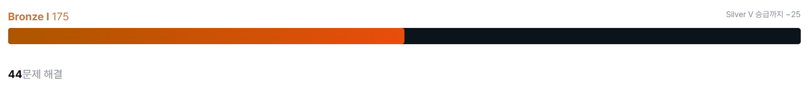
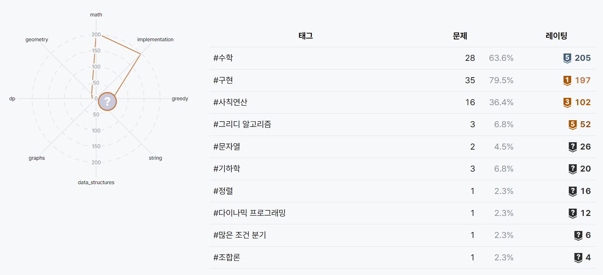
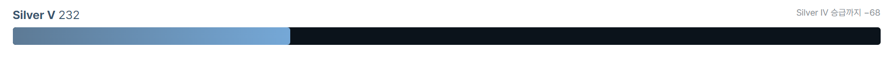
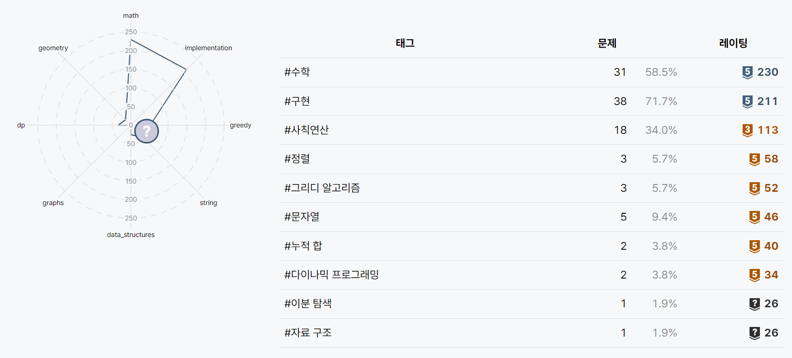

# java-algorithm-master
- 자바로 알고리즘 문제 풀기
- 학습사이트 : 백준, 프로그래머스

## ✨ goals
- 주 2회이상 커밋
- 새로운 개념, 헷갈리는 개념 study.md 작성
- 어려운 문제는 다른 사람 코드 참고해서 **내 것으로 만들기**

## 😂 growing pains

2023.06.28 : 시작

    
    

2023.10.09 : 첫번째 성장통

    
    

## 🤖 programmers
### 배열
1. 교점에 별 만들기 - Level 2
2. 삼각 달팽이 - Level 2
3. 거리두기 확인하기 - Level 2
4. 행렬의 곱셈 - Level 2
### 문자열
5. ~~자연수 뒤집어 배열로 만들기 – Level 1~~
6. ~~시저 암호 - Level 1~~
7. ~~이상한 문자 만들기 – Level 1~~
8. 문자열 압축 – Level 2
9. ~~3진법 뒤집기 - Level 1~~
10. 이진 변환 반복하기 - Level 2
11. ~~문자열 내 p와 y의 개수 - Level 1~~
12. ~~숫자 문자열과 영단어 - Level 1~~
13. ~~문자열 다루기 기본 - Level 1~~
14. ~~신규 아이디 추천 - Level 1~~
### 재귀
15. 쿼드압축 후 개수 세기 - Level 2
16. 하노이의 탑 - Level 3
17. 모음 사전 - Level 2
### 완전탐색
18. ~~모의고사 – Level 1~~
19. 카펫 – Level 2
20. 수식 최대화 - Level 2
21. 소수 찾기 – Level 2
22. 불량 사용자 - Level 3
### 정렬
23. ~~K번째수 – Level 1~~
24. ~~두 개 뽑아서 더하기 - Level 1~~
25. H-index - Level 2
26. ~~문자열 내림차순으로 배치하기 – Level 1~~
27. 문자열 내 마음대로 정렬하기 - Level 1
28. 가장 큰 수 - Level 2
29. 메뉴 리뉴얼 - Level 2
### 이진탐색
30. 순위 검색 - Level 2
31. 입국심사 - Level 3
32. 징검다리 - Level 4
### 해시
33. 전화번호 목록 - Level 2
34. ~~중복된 문자 제거 - Level 0~~
35. ~~A로 B 만들기 - Level 0~~
36. ~~없는 숫자 더하기 - Level 1~~
37. ~~완주하지 못한 선수 - Level 1~~
### 동적 프로그래밍
38. 피보나치 수 - Level 2
39. 정수 삼각형 - Level 3
40. 등굣길 - Level 3
41. 사칙연산 - Level 4
### 자주 등장하는 자료구조
42. 올바른 괄호 - Level 2
43. 괄호 회전하기 - Level 2
44. 주식 가격 - Level 2
45. 기능 개발 - Level 2
46. 다리를 지나는 트럭 - Level 2
47. 순위 - Level 3
48. 방의 개수 - Level 5
49. 길 찾기 게임 - Level 3
50. 이중 우선순위 큐 - Level 3
51. 디스크 컨트롤러 - Level 3
52. 보석 쇼핑 - Level 3
53. 섬 연결하기 - Level. 3
54. 호텔 방 배정 - Level 4
55. 가사 검색 - Level 4
### 구현
56. 스킬트리 - Level 2
57. ~~키패드 누르기 - Level 1~~
58. 타겟 넘버 - Level 2
59. 네트워크 - Level 3
60. 단어 변환 - Level 3
61. 게임 맵 최단거리 - Level 3
62. ~~체육복 - Level 1~~
63. 큰 수 만들기 - Level 2
64. 단속카메라 - Level 3
### 도전: 카카오 2022 블라인드 테스트
65. 신고 결과 받기 - Level 1
66. k진수에서 소수 개수 구하기 - Level 2
67. 주차 요금 계산 - Level 2
68. 양궁대회 - Level 2
69. 양과 늑대 - Level 3
70. 파괴되지 않은 건물 - Level 3
71. 사라지는 발판 - Level 3
### 코딩 전문 역량 인증 시험, PCCP 모의고사
72. 외톨이 알파벳 - Level 1
73. 체육대회 - Level 2
74. 유전법칙 - Level 2
75. 운영체제 - Level 3
76. 실습용 로봇 - Level 1
77. 신입사원 교육 - Level 2
78. 카페 확장 - Level 2
79. 보물 지도 - Level 3

## 📌 baekjoon
- step01 : 입출력문제
- step02 : 수학(합공식, 피보나치수, 약수, 최대공약수, 최소공배수, 소수, 조합/순열)
- step03 : 자료구조(해시, 스택, 큐, 덱, 힙)
- step04 : 재귀, 정렬
- step05 : 다이나믹 프로그래밍(DP)
- step06 : 그래프문제, 기초DFS와 BFS
- step07 : DFS와 BFS응용, 최단 경로 구학
- step08 : 이분 탐색과 분할정복
- step09 : 그리디 알고리즘
- step10 : 완전탐색과 시뮬레이션
- step11 : 구현
- step12 : 문자열
- step13 : 투 포인터, 슬라이딩 윈도우
- step14 : 백트랙킹

## ✒️ study.md
- [01. java 입출력 : Scanner vs BufferedReader](./study/01.md)